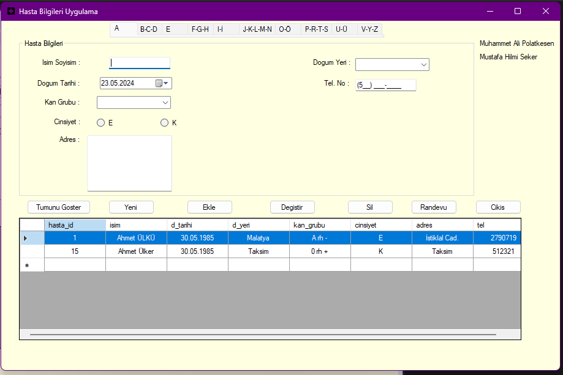
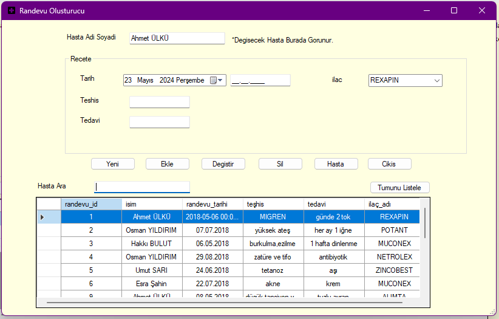

<!DOCTYPE html>
<html lang="en">
<head>
    <meta charset="UTF-8">
    <meta name="viewport" content="width=device-width, initial-scale=1.0">
</head>
<body>

<h1>Hospital Management System</h1>

This is a simple hospital management system developed in C# with Windows Forms and Microsoft Access (ACCDB) database. The system allows users to manage patient information and their appointments effectively.

<h2>Features</h2>
<ul>
    <li><strong>Patient Management:</strong>
        <ul>
            <li>Add new patients</li>
            <li>Edit patient information</li>
            <li>Delete patients</li>
            <li>View patient details</li>
        </ul>
    </li>
    <li><strong>Appointment Management:</strong>
        <ul>
            <li>Add new appointments</li>
            <li>Edit existing appointments</li>
            <li>Delete appointments</li>
            <li>View appointment details</li>
        </ul>
    </li>
</ul>

<h2>Installation</h2>
<ol>
    <li><strong>Clone the repository:</strong>
        <pre><code>git clone https://github.com/maliplt/hospital-automation.git</code></pre>
    </li>
    <li><strong>Open the project:</strong>
        <ul>
            <li>Open the project in Visual Studio.</li>
        </ul>
    </li>
    <li><strong>Setup the database:</strong>
        <ul>
            <li>Ensure you have Microsoft Access installed.</li>
            <li>The database file <code>hasta_bilgisi.accdb</code> should be placed in the root directory of the project.</li>
        </ul>
    </li>
    <li><strong>Build and Run:</strong>
        <ul>
            <li>Build the project in Visual Studio.</li>
            <li>Run the application.</li>
        </ul>
    </li>
</ol>

<h2>Usage</h2>
<ol>
    <li><strong>Add a New Patient:</strong>
        <ul>
            <li>Click the "Add New Patient" button.</li>
            <li>Fill in the required patient details.</li>
            <li>Click "Save" to add the patient to the database.</li>
        </ul>
    </li>
    <li><strong>Manage Appointments:</strong>
        <ul>
            <li>Select a patient from the DataGridView.</li>
            <li>If the patient has no appointments, the system will prompt to add a new appointment.</li>
            <li>Fill in the appointment details and save.</li>
        </ul>
    </li>
    <li><strong>Edit/Delete Patients and Appointments:</strong>
        <ul>
            <li>Select a patient or appointment from the list.</li>
            <li>Click "Edit" to modify the details.</li>
            <li>Click "Delete" to remove the entry from the database.</li>
        </ul>
    </li>
</ol>

<h2>Screenshots</h2>
<h3>Main Form</h3>

<h3>Add Patient</h3>

<h3>Add Appointment</h3>

<h2>Contributing</h2>
<ol>
    <li>Fork the repository.</li>
    <li>Create a new branch for your feature or bugfix.</li>
    <li>Make your changes.</li>
    <li>Submit a pull request.</li>
</ol>

<h2>License</h2>

This project is licensed under the MIT License. See the <a href="LICENSE.txt">LICENSE</a> file for details.

<h2>Acknowledgements</h2>

Thanks to the Mustafa Hilmi Seker for all helpings.

<h2>Contact</h2>

For any inquiries or issues, please contact <a href="polatkesen88@gmail.com">polatkesen88@gmail.com</a>.

</body>
</html>
